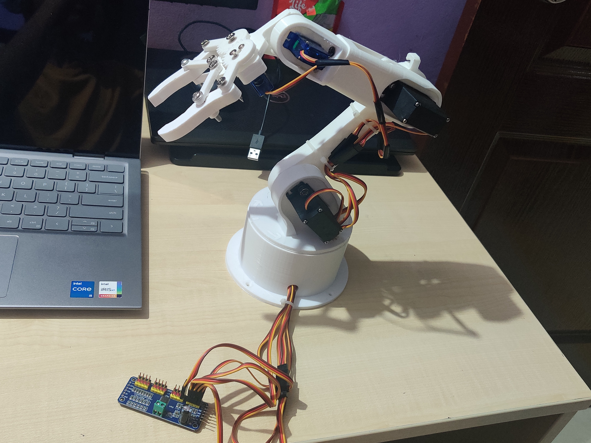

# Robotic-arm
This project is a 4 Degrees of Freedom (DOF) robotic arm designed for precision movement and object manipulation. It features modular control, smooth servo actuation, and customizable control inputs, making it ideal for hobbyists, educators, and research projects.

Features
4 Degrees of Freedom: Includes base rotation, shoulder, elbow, and wrist movements for versatile operation.
Gripper Mechanism: Equipped with a servo-powered gripper for holding objects.
Smooth Motion Control: Uses PWM control for seamless and precise servo actuation.
Customizable Inputs: Can be controlled via potentiometers, joysticks, or programmable interfaces like a microcontroller or computer.
Compact Design: Lightweight and sturdy structure suitable for small to medium loads.

  

# STEP MODEL

  

